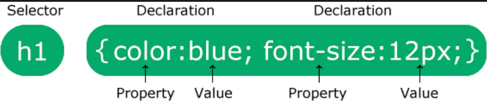

[HTML and CSS](../HTML-and-CSS.md) / CSS

# CSS

- CSS Syntax
    
    
    
- Selectors
    
    used to find the elements you want to style.
    
    - Simple selectors (select elements based on name, id(`#id`), class(`.class`))
    - [Combinator selectors](https://www.w3schools.com/css/css_combinators.asp) (select elements based on a specific relationship between them)
    - [Pseudo-class selectors](https://www.w3schools.com/css/css_pseudo_classes.asp) (select elements based on a certain state)
    - [Pseudo-elements selectors](https://www.w3schools.com/css/css_pseudo_elements.asp) (select and style a part of an element)
    - [Attribute selectors](https://www.w3schools.com/css/css_attribute_selectors.asp) (select elements based on an attribute or attribute value)
- Three Ways to Insert CSS
    
    There are three ways of inserting a style sheet:
    
    - External CSS
        
        ```css
        <!-- as a separate file with .css extension-->
        body {
          background-color: lightblue;
        }
        
        h1 {
          color: navy;
          margin-left: 20px;
        }
        ```
        
    - Internal CSS
        
        ```css
        <!DOCTYPE html>
        <html>
        <head>
        <link rel="stylesheet" href="mystyle.css">
        </head>
        <body>
        
        <h1>This is a heading</h1>
        <p>This is a paragraph.</p>
        
        </body>
        </html>
        ```
        
    - Inline CSS
        
        ```html
        </style>
        </head>
        <body>
        
        <h1 style="color:blue;">This is a heading</h1>
        <p>This is a paragraph.</p>
        
        </body>
        </html>
        ```
        
- Margin
    
    Margins are used to create space around elements, outside of any defined borders.
    
    - `margin-top`
    - `margin-right`
    - `margin-bottom`
    - `margin-left`
    
    ```css
    p {
      margin-top: 100px;
      margin-bottom: 100px;
      margin-right: 150px;
      margin-left: 80px;
    }
    p {  /*short hand*/
    	margin: 25px 50px 75px 100px;
    }
    ```
    
- Padding
    
    Padding is used to create space around an element's content, **inside** of any defined borders.
    
    CSS has properties for specifying the padding for each side of an element:
    
    - `padding-top`
    - `padding-right`
    - `padding-bottom`
    - `padding-left`
    
    ```css
    div {
      padding-top: 50px;
      padding-right: 30px;
      padding-bottom: 50px;
      padding-left: 80px;
    }
    p {  /*short hand*/
    	padding: 25px 50px 75px 100px;
    }
    ```
