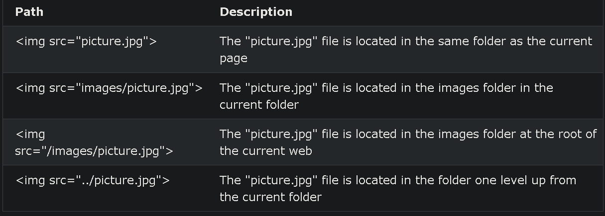

[HTML and CSS](../HTML-and-CSS.md) / HTML

# HTML
## Some HTML Tags

- Embed: to embed external resources to our page
    
    ```html
    <embed type="video/webm" src="blabla.youtube.com">
    ```
    
- Script: to define a client side script
    
    ```html
    <script> <!-- Script goes here --> </script>
    <script src="script.js"></script>
    ```
    
- div: to group sections of a webpage together
    
    ```html
    <div id="navigation">
    	<ul>
    		<li> Home </li>
    		<li> login </li>
    		<li> conact </li>
    	</ul>
    </div>
    ```
    
- image
    
    
    
- List
    - ordered list: list with numbering (could be lettered)
        
        ```html
        <ol>
        	<li> coffee </li>
        	<li> tea </li>
        	<li> macchiato </li>
        </ol>
        ```
        
    - unordered list
        
        ```html
        <ol>
        	<li> coffee </li>
        	<li> tea </li>
        	<li> macchiato </li>
        </ol>
        ```
        
- template: Defines a container for content that should be hidden when the page loads
    
    ```html
    <template>
      <h2>Flower</h2>
      
    </template>
    ```
    
- iframe: to embed another document within the current HTML document.
    
    ```html
    <iframe src="demo_iframe.htm" style="height:200px;width:300px;" title="Iframe Example"></iframe>
    ```
    
- anchor: to link
    
    ```html
    <a href="www.html.com">
    ```
    
- video
    
    ```html
    <video width="320" height="240" controls>
      <source src="movie.mp4" type="video/mp4">
      <source src="movie.ogg" type="video/ogg">
    Your browser does not support the video tag.
    </video>
    ```
    
- `<table>`: to create a table structure
    
    ```html
    <table>
      <tr>
        <th>First Name</th>
        <th>Last Name</th>
      </tr>
      <tr>
        <td>John</td>
        <td>Doe</td>
      </tr>
      <tr>
        <td>Jane</td>
        <td>Smith</td>
      </tr>
    </table>
    
    ```
    
- `<form>`: to create a form for user input
    
    ```html
    <form action="/submit" method="post">
      <label for="name">Name:</label>
      <input type="text" id="name" name="name">
    
      <label for="email">Email:</label>
      <input type="email" id="email" name="email">
    
      <input type="submit" value="Submit">
    </form>
    
    ```
    
- `<h1>` to `<h6>`: to define headings with different levels of importance
    
    ```html
    <h1>This is Heading 1</h1>
    <h2>This is Heading 2</h2>
    <h3>This is Heading 3</h3>
    
    ```
    
- `<span>`: to apply styles or manipulate specific portions of text
    
    ```html
    <p>My favorite color is <span style="color: blue;">blue</span>.</p>
    
    ```
    
- `<button>`: to create a clickable button
    
    ```html
    <button type="button">Click Me</button>
    
    ```

- `div`
    
    The `<div>` element is used as a container for other HTML elements.
    
    ```html
    <div id="navigation">
    	<ul>
    		<li> Home </li>
    		<li> login </li>
    		<li> conact </li>
    	</ul>
    </div>
    ```
    
- Form
    
    A way to collect user input.
    
    Input is sent to the server for processing.
    
    ```html
    		<form>
    <--!.
    form elements
    .-->
    </form>
    ```
    
    - Form Attributes
        - `action`
            
            defines the action to be performed when the form is submitted.
            
            ```html
            <!--On submit, send form data to "action_page.php" file on the server-->
            
            <form action="/action_page.php">
              <label for="fname">First name:</label><br>
              <input type="text" id="fname" name="fname" value="John"><br>
              <label for="lname">Last name:</label><br>
              <input type="text" id="lname" name="lname" value="Doe"><br><br>
              <input type="submit" value="Submit">
            </form>
            ```
            
            ---
            
        - `target`
            
            specifies where to display the response that is received after submitting the form.
            
            | Value | Description |
            | --- | --- |
            | _blank | The response is displayed in a new window or tab |
            | _self | Default; The response is displayed in the current window |
            | _parent | The response is displayed in the parent frame |
            | _top | The response is displayed in the full body of the window |
            | framename | The response is displayed in a named iframe |
            
            ```html
            <form action="/action_page.php" target="_blank">
            ```
            
        - `method`
            
            specifies the HTTP method to be used when submitting the form data.
            
            ```html
            <form action="/action_page.php" method="get">
            ```
            
            - Get
                - Appends the form data to the URL, in name/value pairs
                - NEVER use GET to send sensitive data! (the submitted form data is visible in the URL!)
                - The length of a URL is limited (2048 characters)
                - Useful for form submissions where a user wants to bookmark the result
                - GET is good for non-secure data, like query strings in Google
            - Post
                - Appends the form data inside the body of the HTTP request (the submitted form data is not shown in the URL)
                - POST has no size limitations, and can be used to send large amounts of data.
                - Form submissions with POST cannot be bookmarked
        - The `autocomplete` Attribute
            
            specifies whether a form should have autocomplete on or off.
            
            When autocomplete is on, the browser automatically complete values based on values that the user has entered before.
            
            ```html
            <!--A form with autocomplete on:->
            <form action="/action_page.php" autocomplete="on">
            ```
            
        - The `novalidate` Attribute
            
            specifies that the form-data (input) should not be validated when submitted.
            
            ```html
            <!--A form with a novalidate attribute:-->
            
            <form action="/action_page.php" novalidate>
            ```
            
    - Elements
        - `<input>`
            
            displayed in several ways, depending on the type attribute.
            
            <aside>
            💡 most used
            
            </aside>
            
            <aside>
            💡 each input field must have a `name` attribute to be submitted.
            
            </aside>
            
            - `<input type="button">`
            - `<input type="checkbox">`
            - `<input type="color">`
            - `<input type="date">`
            - `<input type="datetime-local">`
            - `<input type="email">`
            - `<input type="file">`
            - `<input type="hidden">`
            - `<input type="image">`
            - `<input type="month">`
            - `<input type="number">`
            - `<input type="password">`
            - `<input type="radio">`: select only one
            - `<input type="range">`: entering a number whose exact value is not important (like a slider control)
            - `<input type="reset">`
            - `<input type="search">`
            - `<input type="submit">`
            - `<input type="tel">`
            - `<input type="text">`
            - `<input type="time">`
            - `<input type="url">`
            - `<input type="week">`
            
            ```html
            <label for="fname">First name:</label>
            <input type="text" id="fname" name="fname">
            ```
            
            - Input Attributes
                - `readonly`: un-editable
                - `disabled`: un-clickable
                - `value`: initial value
                - `size`: visible width
                - `maxlength`
                - `min` and `max`
                - `multiple`
                - `pattern`
                - `placeholder`
                - `required`: enforce filling before submission
                - `step`: intervals
                - `autofocus`
                - `list`: refer to `<datalist>`
        - `<label>`
            
            defines a label for elements.
            
            - read by screen-reader when input element is on focus.
            - helps users with difficulty clicking on very small regions (such as radio buttons or checkboxes)
            - The `for` attribute of the `<label>` tag should be equal to the `id` attribute of the `<input>` element to bind them together.
            
            ```html
            <label for="fname">First name:</label>
            <input type="text" id="fname" name="fname">
            ```
            
        - `<select>`
            
            defines a drop-down list
            
            ```html
            <label for="cars">Choose a car:</label>
            <select id="cars" name="cars" size="3">
              <option value="volvo">Volvo</option>
              <option value="saab" selected>Saab</option>
              <option value="fiat">Fiat</option>
              <option value="audi">Audi</option>
            </select>
            <!--
            size specify the number of visible values
            multiple to allow multiple value selection
            selected to define a pre-selected option
            -->
            ```
            
        - `<fieldset>`
            
            used to group related data in a form.
            
            - `<legend>` element defines a caption
            
            ```html
            <form action="/action_page.php">
              <fieldset>
                <legend>Personalia:</legend>
                <label for="fname">First name:</label><br>
                <input type="text" id="fname" name="fname" value="John"><br>
                <label for="lname">Last name:</label><br>
                <input type="text" id="lname" name="lname" value="Doe"><br><br>
                <input type="submit" value="Submit">
              </fieldset>
            </form>
            ```
            
        - `<datalist>`
            
            specifies a list of pre-defined options for an `<input>` element.
            
            ```html
            <form action="/action_page.php">
              <input list="browsers">
              <datalist id="browsers">
                <option value="Edge">
                <option value="Firefox">
                <option value="Chrome">
                <option value="Opera">
                <option value="Safari">
              </datalist>
            </form>
            ```
            
    - Input form Attributes
        - `form`: specifies the form the input element belongs to.
        - `formaction`: specifies the URL of the file that will process the input when submitted.
        - `formenctype`: specifies how the form-data should be encoded when submitted.
        - `formmethod`: def
        - `formtarget`
        - `formnovalidate`
